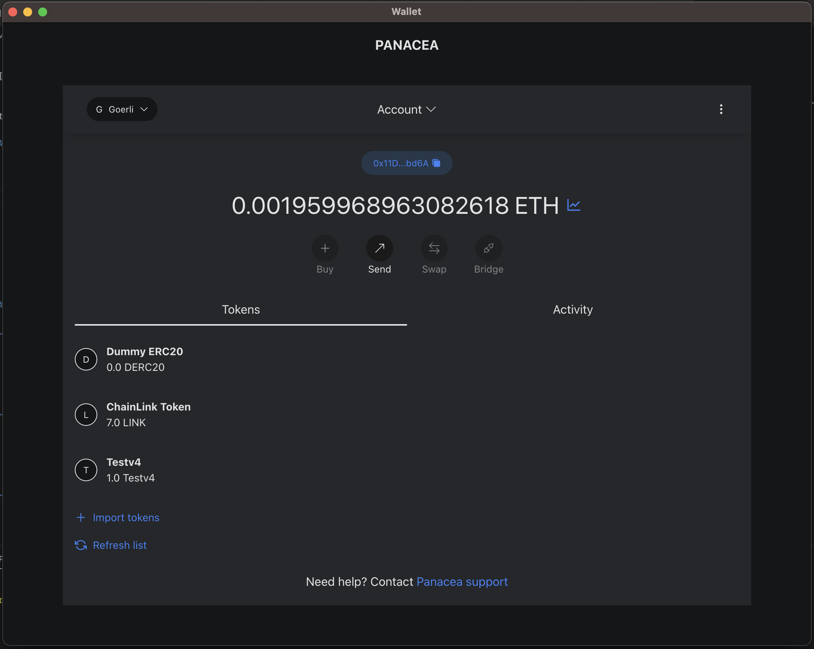
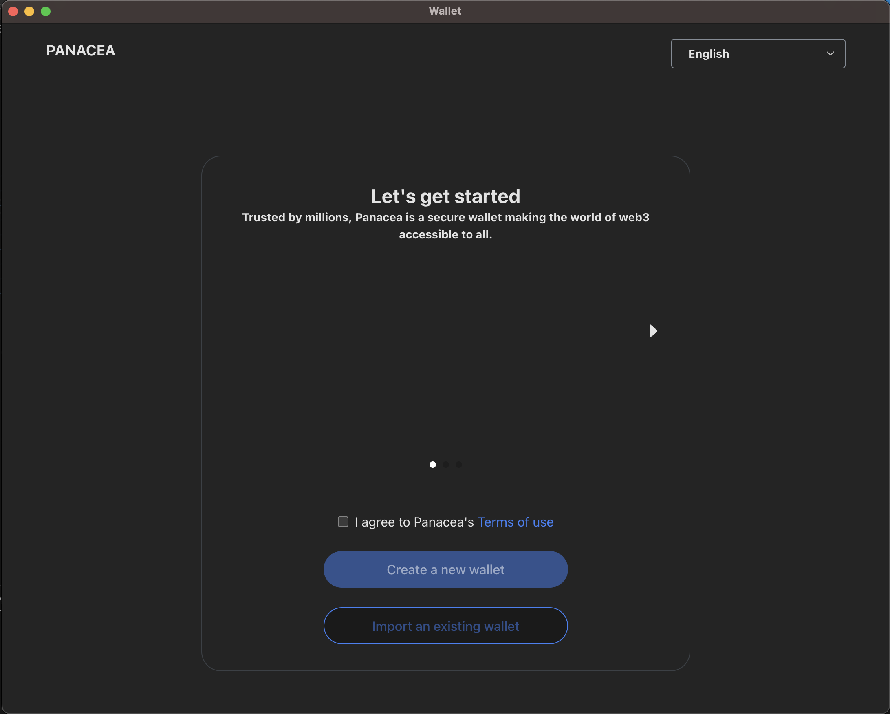
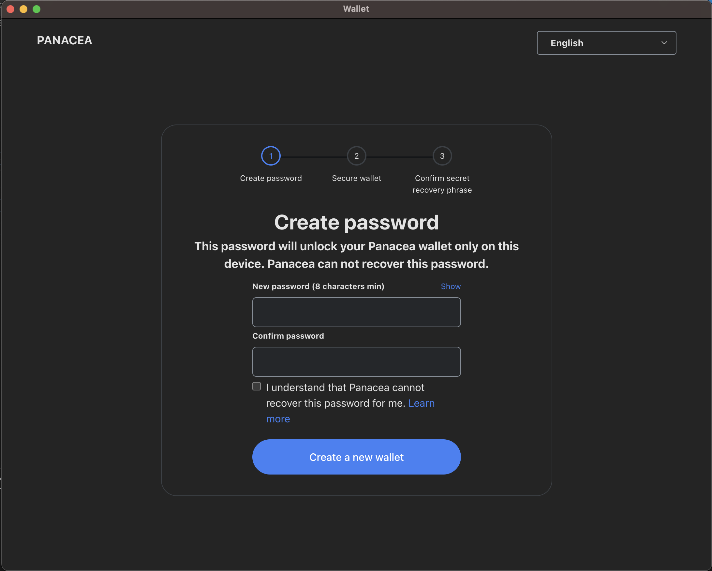
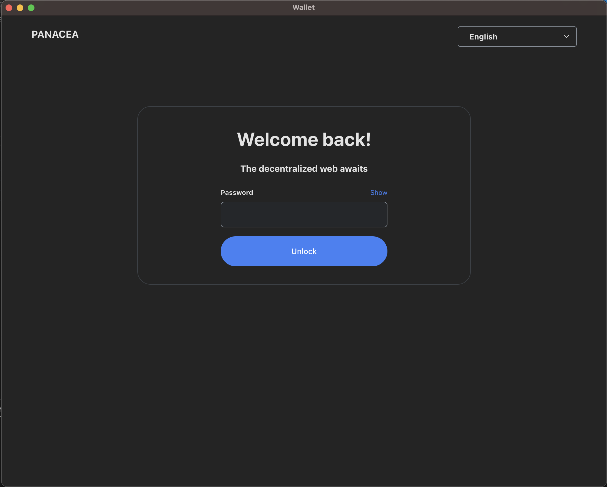

# Crypto-Wallet Desktop



> Crypto-Wallet Desktop is a decentralized Ethereum wallet built with Electron.js, Vite.js, React.js, TypeScript, and Ethers.js. It provides a user-friendly interface for managing Ethereum and ERC20 tokens, allowing users to send transactions securely and conveniently.

This project is specifically designed for educational purposes and aims to provide an accessible and beginner-friendly codebase. Whether you're a novice developer looking to learn more about building decentralized applications or an experienced developer interested in exploring Ethereum wallets, Crypto-Wallet Desktop is an excellent starting point.

The UI design of Crypto-Wallet Desktop draws inspiration from popular Ethereum wallets like MetaMask, providing users with a familiar and intuitive interface. However, please note that Crypto-Wallet Desktop is not affiliated with or endorsed by MetaMask.

## Features

- :white_check_mark: **Send Ethereum Transactions**: Send Ether (ETH) from your wallet to other Ethereum addresses.
- :white_check_mark: **ERC20 Token Support**: Send transactions with ERC20 tokens, including popular tokens like DAI, USDT, and more.
- :white_check_mark: **Secure Key Management**: Store your private keys securely on your device, ensuring full control of your funds.
- :white_check_mark: **Transaction History**: View a detailed history of your past transactions, including their status and transaction details.
- :white_check_mark: **Balance Overview**: Keep track of your Ethereum and ERC20 token balances in a single dashboard.
- :white_check_mark: **Network Switching**: Connect to different Ethereum networks, such as Mainnet, Testnet, or a custom network of your choice.
- :white_check_mark: **QR Code Support**: Easily scan QR codes for wallet addresses and transaction details.
- :construction: **Custom Gas Fees**: Set your preferred gas price and gas limit for transactions according to your needs.
- :construction: **Multi-Language Support**: Choose from a range of languages to personalize your wallet interface.

## Installation

1. Clone the repository:

   ```bash
   git clone https://github.com/vatheara/crypto-wallet-desktop.git
   ```

2. Navigate to the project directory:

   ```bash
   cd crypto-wallet-desktop
   ```

3. Install the dependencies:

   ```bash
   npm install
   ```

4. Start the electron:

   ```bash
   npm run dev
   ```

5. Navigate to the react project directory:

   ```bash
   cd vite-project
   ```

6. Start the react:

   ```bash
   npm run dev
   ```

   The application will be launched in development mode.

## Screenshots





## Contributing

Contributions are welcome! If you have any ideas, bug reports, or feature requests, please open an issue or submit a pull request. Make sure to follow the code of conduct.

To contribute to Eth-Wallet Desktop, follow these steps:

1. Fork the repository.
2. Create a new branch: `git checkout -b my-feature-branch`.
3. Make your changes and commit them: `git commit -am 'Add new feature'`.
4. Push to the branch: `git push origin my-feature-branch`.
5. Submit a pull request.

Please ensure that your pull request adheres to the project's guidelines and coding conventions.

## License

This project is licensed under the MIT License. See the [LICENSE](https://github.com/vatheara/crypto-wallet-desktop/blob/main/LICENSE) file for details.

## Acknowledgements

Eth-Wallet Desktop was made possible thanks to the following open-source projects:

- Electron.js - https://www.electronjs.org/
- Vite.js - https://vitejs.dev/
- React.js - https://reactjs.org/
- TypeScript - https://www.typescriptlang.org/
- Ethers.js - https://docs.ethers.org/v5/

Special thanks to the Ethereum community for their continuous support and inspiration.

## Contact

For any inquiries or feedback, please contact [theara2048@gmail.com](mailto:theara2048@gmail.com).

Follow us on Twitter [@VaTheara](https://twitter.com/VaTheara) for updates and announcements.
